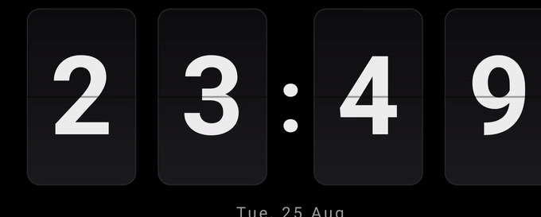
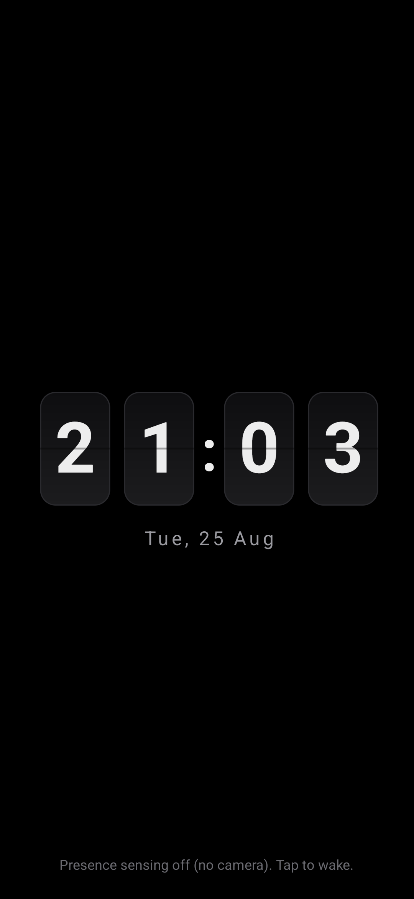
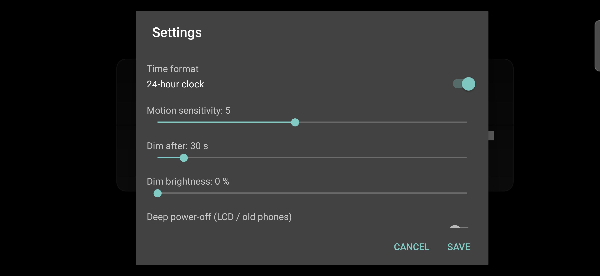
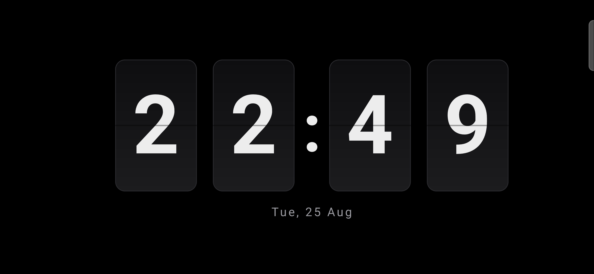

# Presence Flip Clock

A full-screen flip clock for an **old, non-rooted Android phone** turned into a desk clock.
The front camera senses when someone is nearby: the clock is **bright when you are present**
and fades to **near-black when the room is still**, then lights back up the moment you move.

No root. No special hardware. No account. Nothing leaves the device.

## Screenshots

The flip animation, captured on a real device (Samsung Galaxy S25 Ultra):

| Clock | Settings (live values, long-press) |
|---|---|
|  |  |

On a real device, landscape:

> Presence dimming changes the backlight, not the pixels, so screenshots always look bright -
> the dim/brighten effect is only visible on the physical panel. See
> [docs/TESTING.md](docs/TESTING.md).

## Why brightness, not screen-off?

Turning the screen fully off on Android needs either root or a Device Admin lock, and once
the screen is off a non-root app can no longer read the camera (Android restricts background
camera access). So this app takes the approach that actually works within those limits:

- It stays in the foreground with the screen kept on, and modulates **window brightness**
  (full when present, ~2% when idle). Window brightness is app-local and needs **no
  permission at all**.
- Because the app stays foreground, the camera keeps analysing frames on every Android
  version, so presence detection is reliable.

The trade-off: the panel is technically always on (dimmed), so on OLED there is some standby
power draw and long-term burn-in risk. The clock nudges its position a few pixels each minute
to spread that wear. For a phone living on a charger as a clock, this is a good trade.

## How presence detection works

`MotionAnalyzer` reads only the camera's **luminance plane** into a 32x24 grid and compares
each frame to the last one. If the average change crosses a threshold (set by the sensitivity
slider), that counts as motion. No frame is ever decoded to an image, saved, or sent
anywhere - it is a few hundred brightness samples in memory, discarded immediately.

## Features

- Big flip-card clock with a per-digit flip animation, 12h or 24h
- Presence dimming via the front camera (tunable sensitivity and idle timeout)
- **Deep power-off mode** (opt-in, for LCD / old phones): truly turns the screen off when
  idle via Device Admin, instead of dimming - no backlight glow. Wake with the power button.
- Tap anywhere to wake (works even if you deny the camera)
- Shows over the lock screen, stays full-screen, keeps the screen on
- Gentle anti-burn-in pixel shift
- Long-press to open settings; sliders show their live value as you drag (e.g. "Dim after: 30 s")

## Permissions

- `CAMERA` - the only permission, used solely for on-device motion sensing. Deny it and the
  clock still works; it just dims on a timer and wakes on tap instead of on motion.

## Install

**Easiest - grab the built APK:**
1. Go to the repo's **Actions** tab, open the latest **build** run, and download the
   `presence-flip-clock-debug` artifact, or grab the APK from a tagged **Release**.
2. Copy the APK to the phone and open it. Allow "install from unknown sources" if asked.
3. Launch it, allow the camera, and stand it on a charger.

**Build it yourself:**
- Open the project in Android Studio (Giraffe or newer) and Run, or
- From a machine with the Android SDK and a JDK 17: `./gradlew :app:assembleDebug`
  (the APK lands in `app/build/outputs/apk/debug/`).

Notes from building this locally:
- Build with **JDK 17** (`JAVA_HOME` pointed at a 17 JDK). AGP 8.5 is happiest there.
- Avoid a project path with **spaces** on Windows - AGP's JDK-image step can choke on it.
- Create `local.properties` with your SDK path using forward slashes, e.g.
  `sdk.dir=C:/Users/you/AppData/Local/Android/Sdk` (it is git-ignored).

> This ships as a **debug** APK for simplicity. To publish a signed release build, add your
> own signing config - see the Android docs on app signing.

## Verified

Built with the Android SDK (compileSdk 34, build-tools 34) on JDK 17, and tested on both a
Pixel 5 (API 34) emulator and a real **Samsung Galaxy S25 Ultra (Android 16)**: launches
clean, flip clock + date render (portrait and landscape), clock ticks, tap-to-wake and the
long-press settings dialog work. On the real device the **front camera binds and streams**,
so presence sensing is exercised on real hardware; with no camera (emulator) it falls back to
tap-to-wake. Full matrix in [docs/TESTING.md](docs/TESTING.md).

## Two idle behaviours

- **Dim (default)** - screen stays on and fades to fully black via window brightness; the
  camera wakes it. Perfect on OLED (looks off), and presence-driven. On an **LCD** panel,
  brightness 0 can still show a faint backlight glow.
- **Deep power-off (opt-in, Settings)** - when idle, the screen is truly powered off using a
  Device Admin lock, so there is zero glow (ideal for LCD / 5-10 year old phones). Trade-off:
  a truly-off screen cannot run the camera, so you **wake it with the power button**, not by
  presence. For a dedicated clock phone, set the screen lock to None (Settings -> Security) so
  the clock is glanceable the instant you wake it.

## Tips for a good desk clock

- Keep it on the charger; disable the system screen timeout is not needed (the app overrides it).
- Point the front camera at the room, not a wall.
- If it dims too eagerly, lower the sensitivity or raise the idle timeout in settings.
- Battery Optimization: exclude the app so the OS does not kill it overnight
  (Settings -> Apps -> Presence Flip Clock -> Battery -> Unrestricted).

## Requirements

- Android 5.0 (API 21) or newer
- A front camera (optional - without it, tap-to-wake still works)

## Tech

Kotlin, CameraX (`ImageAnalysis` only, no preview surface), plain Android Views, no
third-party UI libraries. Min SDK 21, target SDK 34.

## Documentation

- [docs/ARCHITECTURE.md](docs/ARCHITECTURE.md) - components, data flow, and the
  brightness-not-power design rationale.
- [docs/TESTING.md](docs/TESTING.md) - test environments (PC SDK, Pixel 5 emulator,
  S25 Ultra real device, CI) and the verification matrix.

## License

MIT - see [LICENSE](LICENSE).
